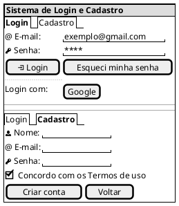
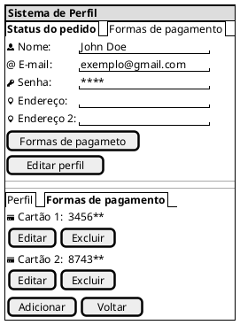
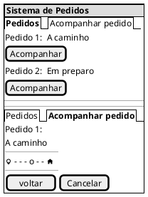
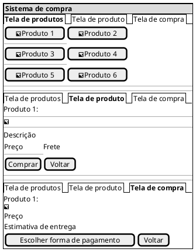

## Introdução
 

A construção do protótipo para auxilia a equipe de desenvolvimento a encontrar um nível de detalhes abrangentes, extrair funcionalidades, e também fornece uma base para o gerenciamento do projeto pois com o protótipo é possível realizar estimativas de quanto tempo será necessário desempenhar em cada funcionalidade.

 
## Metodologia
 

Iniciamos o projeto através dos levantamentos iniciais da equipe, após discussões a ferramenta PlanUml foi selecionada para produzir o protótipo.

 
## Protótipo
 
### Versão Beta
 
### Tela Login e cadastro

### Tela de Perfil

### Tela de Pedidos

### Tela de Produtos e Compra

Na primeira versão do protótipo utilizamos a ferramenta PlantUml para criar o protótipo

 
## Referências
 
> Material Design Color Tool. Disponível em:  https://material.io/resources/color/#!/?view.left=0&view.right=0
 
> PMI. Um guia do conhecimento em gerenciamento de projetos. Guia PMBOK® 5a. ed. EUA: Project Management Institute, 2013.
 
> Ferramenta Figma. Disponível em https://www.figma.com
 
## Autor(es)
 
| Data | Versão | Descrição | Autor(es) |
| -- | -- | -- | -- |
| 08/04/25 | Beta | Criação do documento | Rodrigo de Sousa Ferrett |