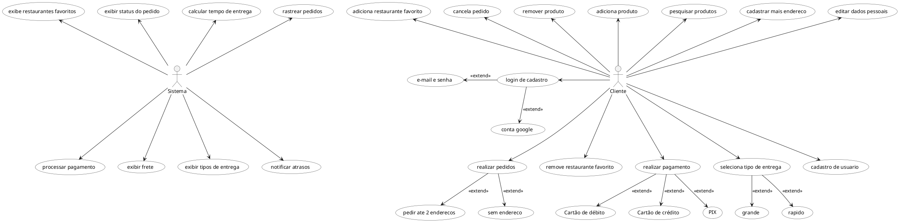

## Diagrama de Casos de usos

### Versão 1.0

## Referências

> UML Class and Object Diagrams Overview. Disponível em https://www.uml-diagrams.org/class-diagrams-overview.html. Acesso em 21/09/20

> UML Class Diagram Tutorial. Disponível em https://www.youtube.com/watch?v=UI6lqHOVHic. Acesso em 21/09/20

> UML Class Relationship Diagrams. Disponível em https://www.cs.odu.edu/~zeil/cs330/latest/Public/classDiagrams/index.html#other-class-diagram-elements Acesso em 19/10/20

## Autor(es)

| Data | Versão | Descrição | Autor(es) |
| -- | -- | -- | -- |
| 08/04/25 | 1.0 | Criação do documento | João Pedro, Pedro Silvestre |
