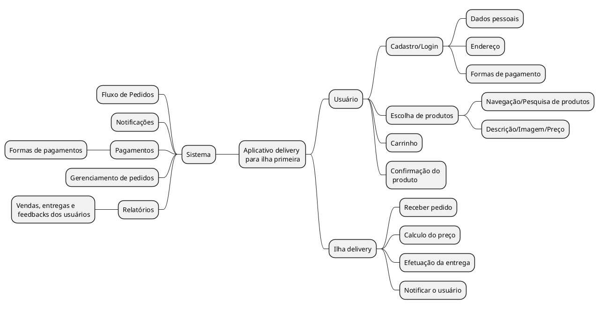

 
## Introdução
 

Mapa mental consiste em criar resumos cheios de símbolos, cores, setas e frases de efeito com o objetivo de organizar o conteúdo e facilitar associações entre as informações destacadas. Esse material é muito indicado para pessoas que têm facilidade de aprender de forma visual.

 
## Metodologia
 

Foi levantado um ponto importante sobre o app e, assim, foi produzido o mapa mental. O documento foi produzido utilizando a ferramenta plantuml.

 
## Mapa mental - Geral.
 
## Versão 1.0
 
### Mapa mental 1

 
### Mapa mental 2
 

 
## Conclusão
 

O mapa mental é uma ficha de estudos que ajuda a dar uma visão geral do tema, e ajuda a fixar os pontos mais importantes sobre o app.

 
## Referências
> Mapa MentalXXX,  Disponível em: https://www.....
 
> Ferramentas para Mapas Mentais. Disponível em: https://www....
 
> Plataforma para usuários colaborar no desenho... Disponível em: https://...
 
## Versionamento
| Data | Versão | Descrição | Autor(es) |
| -- | -- | -- | -- |
| dd/mm/yy | 1.0 | Criação do documento | xxx xxxx |
| dd/mm/yy | 2.0 | Adicionado Mapa mental 2 | xxxx xxxx |
