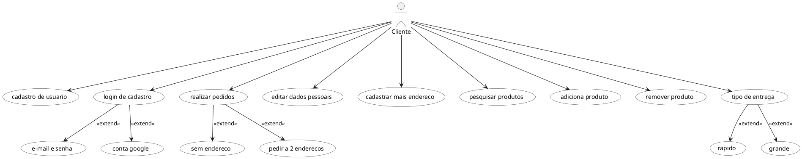

## Diagrama de Casos de usos

### Versão 1.0

## Referências

> UML Class and Object Diagrams Overview. Disponível em https://www.uml-diagrams.org/class-diagrams-overview.html. Acesso em 21/09/20

> UML Class Diagram Tutorial. Disponível em https://www.youtube.com/watch?v=UI6lqHOVHic. Acesso em 21/09/20

> UML Class Relationship Diagrams. Disponível em https://www.cs.odu.edu/~zeil/cs330/latest/Public/classDiagrams/index.html#other-class-diagram-elements Acesso em 19/10/20

## Autor(es)

| Data | Versão | Descrição | Autor(es) |
| -- | -- | -- | -- |
| 21/09/20 | 1.0 | Criação do documento | João Pedro, Lucas Alexandre, Matheus Estanislau, Moacir Mascarenha e Renan Cristyan |
| 28/09/20 | 1.1 | Ajustes no documento | João Pedro e Renan Cristyan |
| 28/09/20 | 1.2 | Adicionado diagrama de classes 1.1 | João Pedro e Renan Cristyan |
| 26/10/20 | 2.0 | Adicionado diagrama de classes 2.0 | João Pedro, Lucas Alexandre, Matheus Estanislau, Moacir Mascarenha e Renan Cristyan |